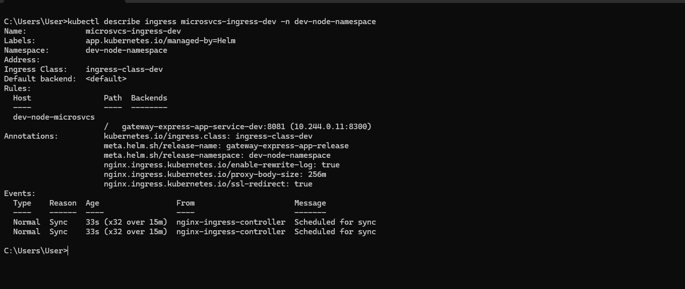
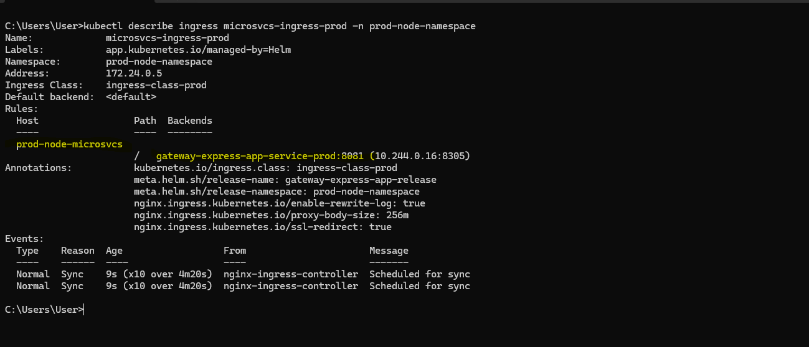

This is seperate repository for adding express-gateway and nginx configuration files.

We can run the project locally without docker, with docker using Docker Desktop and on a remote server(using compose and swarm)

# Deployment strategy for Non-Swarm scenario
We will be using the compose files within docker folder when deploying all connected microservices like cart,gateway and ek 
to the same VM.

Deploy elk before other microservices because the latter depends on the former.
Let the former keep running.

Also deploy the cart and product microsvcs before gateway because gateway depends on these
microsvcs.

The .github/workflows/build-deploy.yml contains the workflow for building the project and deploying
to the Azure VM.

We have deployed all the 3 microservices and the ELK to the same VM to keep it simple.
So we have 2 VM's for 2 environments: dev and prod. Each VM has all the microservices and elk deployed.
No docker swarm in use in this scenario.
Ensure docker installed in the 2 VM's.

=>Build only the services that have Dockerfiles
=>Build each microservice once, not per replica
=>CI/CD should build → push → deploy, not rebuild on the server
=>Let Docker Compose pull the images in the remote server and run them

In the Github action, we are building images for only those docker services which use Dockerfile
and pushing them to Dockerhub.
Both express and nginx use Dockerfiles. So we are building docker images for these 2 services alone
and pushing them to Dockerhub.
The mongo services uses the inbuilt docker image. So no seperate building/pushing is required.
Note that building and pushing for express and nginx is required when deploying to dev environment,
followed by pulling those images in the VM.
In prod environment, we just need to pull the already built and pushed images in the VM.


So we are maintaining seperate docker-compose files for deployment and local run.
The build field will be provided only in the docker-compose.local.yml and it will be omitted in the
docker-compose.yml. 
This is because for local run ,we need to build the image and run it in DockerDesktop.

For deployment, we have a github action building and pushing the image. To pull the image in the VM,
we just need the image name in the docker-compose.yml.

Another important point to note is that the VM requires the compose and environment files in the VM
to pull the image. It also requires the nginx config files for dynamic injection of config file based on
deployment environment. So we have used the scp action to copy the docker folder and its contents
to a dedicated folder in the vm.  Post this, we execute the "compose pull" and "compose up" 
commands in the github action.

```
 - name: Copy compose files to VM
            uses: appleboy/scp-action@v0.1.7
            with:
              host: ${{ secrets.AZURE_VM_IP }}
              username: ${{ secrets.AZURE_VM_USER }}
              key: ${{ secrets.AZURE_VM_SSH_KEY }}
              source: "docker/**"
              target: "/home/${{ secrets.AZURE_VM_USER }}/${{vars.APP_NAME}}"

```

For sending logs to ELK, we using winston to send logs to a path. Filebeat will read the logs from the file and send to logstash.
ElasticSearch will do the indexing and send to Kibana for display.
So the paths are extremely important.

The env variables exposed throught github actions are accessible to the compose files in the github vm.
As long as you the docker containers are running in the github vm, there is no issue.
But when the compose files are copied to the VM, they no longer can access the environment variables exposed in the github actions.
The compose files entirely rely on inline env variables/ env files.
So we have to create .env file in the deploy step with the variables required to make further decisions as you see below:
Compose will automatically pick the .env file. There is no need to specify it in the compose file.

```
  cat <<EOF > /home/${{ secrets.AZURE_VM_USER }}/${{vars.APP_NAME}}/docker/.env 
               DOCKERHUB_USER=${{ vars.DOCKERHUB_USERNAME }} 
               APPNAME=${{ vars.APP_NAME }} 
               TAG=${{ env.TAG }} 
               TARGETENV=${{ github.event.inputs.environment }} 
               EOF

```

# application flow

client <----> nginx <---> express-gateway <----> cart/product microservice <---> mongodb

Here nginx acts a reverse proxy and load balances multiple instances of express-gateway
Express-gateway is for routing requests to the correct microservice and also load balancing between the different instances of
the cart and product microservice.
Note that the microservices will commmunicate with each other via the express-gateway.

nginx acts as edge gateway and express-gateway acts as api gateway

### 🧭 API Gateway vs Edge Gateway

| Feature                  | **API Gateway**                                         | **Edge Gateway**                                         |
|--------------------------|---------------------------------------------------------|----------------------------------------------------------|
| **Primary Role**         | Manages API traffic between clients and services        | Manages all traffic entering the network or cluster      |
| **Scope**                | Focused on APIs and microservices                       | Broader scope: APIs, web apps, static content, etc.      |
| **Location**             | Sits between client and backend APIs                    | Sits at the network edge, often before API gateway       |
| **Functions**            | Authentication, rate limiting, routing, caching         | SSL termination, load balancing, firewall, DDoS protection |
| **Protocols**            | Mostly HTTP/HTTPS, REST, GraphQL                        | Supports HTTP, TCP, UDP, TLS, and more                   |
| **Examples**             | Kong, Express Gateway, Apigee, AWS API Gateway          | NGINX, Envoy, Cloudflare Gateway, NGINX Gateway Fabric   |
| **Use Case**             | API management and developer control                    | Network-level security and traffic control               |

---

### 🧠 How They Work Together

In many setups, **edge gateways and API gateways are layered**:

```
Client → Edge Gateway (NGINX) → API Gateway (Express Gateway) → Microservices
```

- **Edge Gateway** handles TLS, load balancing, and basic routing.
- **API Gateway** enforces API-specific policies like JWT auth, quotas, and versioning.


# Project Setup

```
git init
npm init

npm i -g express-gateway

eg gateway create

Below is logged on execution of above command. A MicroservicesAPIGateway folder is created with many files.

C:\Users\User\angular\node-microservices\gateway>eg gateway create
Configuring yargs through package.json is deprecated and will be removed in a future major release, please use the JS API instead.
Configuring yargs through package.json is deprecated and will be removed in a future major release, please use the JS API instead.
Configuring yargs through package.json is deprecated and will be removed in a future major release, please use the JS API instead.
? What's the name of your Express Gateway? MicroservicesAPIGateway
? Where would you like to install your Express Gateway? MicroservicesAPIGateway
? What type of Express Gateway do you want to create? Getting Started with Express Gateway
   create package.json
   create server.js
   create config\gateway.config.yml
   create config\system.config.yml
   create config\models\applications.json
   create config\models\credentials.json
   create config\models\users.json

```

For logging, we have installed Winston and for loading environment variables from local.env when running locally, installed dotenv as a dev dependency.


# Local Development

For local development, we will route all requests from client(browser) to the express-gateway, which in turn will route it to the
microservice.
For microservice-A to communicate with microservice-B, microservice-A will send request to the express-gateway, which in turn
will send the request to microservice-B.

To start the express-gateway, we run the below script.

`
    "local": "set DOTENV_CONFIG_PATH=./local.env&&node -r dotenv/config MicroservicesAPIGateway/server.js >> combined.log 2> error.log"

`

This script uses the local.env environment file and executes the server.js in the MicroservicesAPIGateway folder.

So we have used >> to append the standard output (stdout) of the node command to the combined.log file.
Also we are using 2> to redirect the standard error(stderr) of the node command to the error.log file.

=> Load Balancing: Locally, there is only 1 instance of each microservice as you see below, so there is no way to demonstrate load balancing capability of express-gateway. In docker this can be demonstrated.

```
serviceEndpoints:
  productService:
    urls:  
     - http://localhost:3601
    
  cartService:
    urls: 
      - http://localhost:3602
    
```

=> Logging:

Express-Gateway provides a in-built "log" plugin to write a log message.

```

- log: 
          - action:
              message: |
                    Request received:
                    Protocol: "${req.protocol}"
                    Method: "${req.method}"
                    Host: ${req.headers.host}
                    URL: ${req.originalUrl}
                    Headers: ${JSON.stringify(req.headers)}
                    Timestamp: ${new Date().toISOString()}

```

We can integrate Winston logger with Express-Gateway using a custom plugin.

In Express Gateway, policies and plugins are closely related but serve distinct roles in extending and customizing the gateway’s behavior. 

Plugin: A container for reusable functionality that can include policies, conditions, and schemas.
Pipline:A specific function that modifies request/response behavior in the gateway pipeline.

So I have created a logger-plugin which acts as a container for the custom-logger policy.

For this, i have created a plugins folder within MicroservicesAPIGateway.
Within the plugins folder , create a folder with the same name as your plugin i.e logger-plugin

Within the logger-plugin folder, created policies folder and an index.js file.

The policies folder contains 2 .js files: logger-policy.js and winstonLogger.js

In winstonLogger.js, we  have configured to display the log messages created using .info, .debug,
.error methods of winston on the console and also in files.
So any errors reported using the .error() in the app will get appended to the error.log
Messages created via .debug or .info will be appended to the combined.log

For local run, the files remain error.log and combined.log. With docker, the file paths change
and is available in the compose file.

```
            filename:process.env.stderrPath || 'error.log',
            filename:process.env.stdoutPath || 'combined.log'


```


In the logger-policy.js, we have defined the message to created via the winston logger.

```
winstonLogger.info(`Received a request on ${req.protocol}://${req.headers.host}${req.originalUrl}`);

```

If you need to pass dynamic parameters from the .yml file to the policy,  you can add properties
in the logger-policy.js. The same properties can be accessed in the yml and you can feed values to these
properties in the yml dynamically.

```
 properties: {
        message: {
          type: 'string',
          default: ''
        }
      }
```

We have also given a name to the policy

```
    name: 'custom-logger',

```

In the yml, we have accessed the custom-logger policy as below.

```
 - custom-logger:
           - action:
               message: 'Writing a log message to Winston logger'

```

Finally in the index.js, we have provided the path to the logger-policy.js file.

```
 init: function (pluginContext) {
      pluginContext.registerPolicy(require('./policies/logger-policy'));
    },

```

In the system.config.yml, we have provided the name of plugin i.e logger-plugin and also the path to the plugin
in the package field. In docker, we use the env variable pluginPath defined in the common.env and for local we use the
./plugins/logger-plugin path. Note : ":-" means the value on the LHS is the default value if env variable value is not defined.

```
plugins:
   logger-plugin:
      package: ${pluginPath:-./plugins/logger-plugin}
```

So we have 3 kinds of logs here:
=>Using log policy
=>Express gateway stdout and stderr
=>Using custom-logger policy

Since we are using winston in the custom-logger policy, we can transport the logs to a file.
With docker, fi

Moving to rate-limit policy,

We can define how many times a particular api endpoint can be called based on multiple parameters.
Below is an example for productApi endpoint. 
rateLimitBy is the parameter based on which the limiting will be done. req.headers.host will contain the hostname:port.
If the same hostname:port is calling the productApi endpoint more than 4 times in 1 min, you will receive a message as mentioned below.

```
- rate-limit:
           - action:
              max: 4
              windowMs: 60000
              message: 'You have exceeded 4 requests/min'
              rateLimitBy: ${req.headers.host}

```

If you dont have different rate-limit policies for different apiEndpoints, you can consider writing a single rate-limit policy
under common apiendpoint.

Ensure the rate-limit policy is before the proxy policy so that it is evaluated first
Otherwise the rate-limit policy will not work

## Communication between microservices:

Microservice A will not directly communicate with Microservice B

Microservice A will send a request to nginx/express-gateway.
express-gateway/nginx will forward the request to Microservice B, get the response 
and send it to Microservice A.

Its important that in the request, we are including the path that helps the express
gateway route to the correct microservice to fulfill that request.

# Environment files:

We are using local.env for local running without docker.
docker/environments/dev.env for dev docker container and docker/environments/prod.env for prod docker container
docker/environments/common.env defines variables common to both dev and prod docker containers.

We are also using docker/environments/local.env when running locally using docker. This provides additional info like
docker tag, dockerhub username etc. Based on whether environment is dev/prod, the dev.env/ prod.env will be used in the override file.

# Docker

Lets understand the docker compose files.

In the docker folder, we have a compose file for deployment and local docker container run :
docker-compose.local.yml and docker-compose.yml.
The override files are common to both.

In docker-compose.local.yml, we do not provide the image, just the build field to build the docker
image using the Dockerfile.

In docker-compose.yml, we have just provided the image name to be pulled from Dockerhub from the target
server. The images will be pre-built using Github actions docker/build-push-action@v5

We need to have 3 instances of the express-gateway-server. Instead of providing 3 duplicates of the
same service within the compose file, we just define 1 service with the name:express-gateway-service.

When pulling the image and running the container, we provide the "--scale" to create multiple instances of the provided service.

"--scale express-gateway-service=3" will create 3 instances of the express-gateway-service

Below is an example for local run:

```
 "docker-local-dev-up": "cross-env TARGETENV=dev docker compose --env-file docker/environments/local.env -p gateway-dev -f docker/docker-compose.local.yml -f docker/docker-compose.dev.override.yml up -d --remove-orphans --no-build --scale express-gateway-service=3",
```
Same approach used for deployment as well:

```
docker compose \
               -p ${{vars.APP_NAME}}-${{ github.event.inputs.environment }} \
               -f docker/docker-compose.yml \
               -f docker/docker-compose.${{ github.event.inputs.environment }}.override.yml \
               up -d --remove-orphans --no-build \
               --scale express-gateway-service=3
```

We always create the docker image once when deploying to dev environment and pull it from the VM for dev and prod environments for creating
the containers.

Also observe the usage of expose: and ports: . The ports: field is only used for nginx because it needs to be accessed in the browser.
The expose: field is used for the express-gateway-service because we need to only expose to other services in the network and not to the 
internet.


## 🧩 How environment variables actually work in Docker

### 1. **Environment variables are available *inside the running container’s process environment***  
A file inside the container (like an Nginx template, a Node.js script, a shell script, etc.) can access an environment variable **only if that variable exists in the container’s environment at runtime**.

### 2. **How do environment variables get into the container?**  
They can come from several sources:

| Source | Does it make the variable available inside the container? |
|--------|-----------------------------------------------------------|
| `environment:` in `docker-compose.yml` | ✅ Yes |
| `env_file:` in `docker-compose.yml` | ✅ Yes |
| `docker run -e VAR=value` | ✅ Yes |
| `docker run --env-file file.env` | ✅ Yes |
| `ENV VAR=value` in Dockerfile | ✅ Yes (but baked into the image) |
| Variables defined only in your host shell | ❌ No, unless passed explicitly |

By convention, Docker Compose automatically looks for a file named .env in the same directory as your docker-compose.yml (or compose.yaml).
If found, variables from this file are loaded automatically.
You do not need to explicitly declare it with env_file: in the service definition or pass --env-file on the CLI.

So **environment variables are NOT limited to only `environment:` or `env_file:`**.  
They just need to be part of the container’s environment when it starts.

### 3. **Files inside the container cannot magically read host environment variables**  
A file like:

- `/etc/nginx/templates/default.conf.template`
- `/usr/src/app/config.js`
- `/app/.env` (unless you copy it)
- Any script inside the container

…can only access variables that Docker injected into the container environment.

### 4. **Template engines (like envsubst, Nginx templates, etc.) only see variables in the container environment**  
If you’re using:

- `envsubst`
- Nginx’s `template` feature
- A Node.js script reading `process.env`
- A shell script reading `$VAR`

They all rely on the container’s environment.

If the variable wasn’t passed via:

- `environment:`
- `env_file:`
- `docker run -e`
- `ENV` in Dockerfile

…it simply won’t exist.

---

## 🧠 The key rule  
**A variable is accessible only if it exists in the container’s environment at runtime.**  
How it got there doesn’t matter — but it must be injected by Docker.

.env → used for Compose file substitution.

environment: or env_file: or --env-file is used for container runtime environment.

So any environment variables exposed from Github actions, are added to the .env file in the same folder as docker-compose in the VM.
This ensures the compose file picks them up but they will not be available in the container.
```
 cat <<EOF > /home/${{env.VM_USER }}/${{vars.APP_NAME}}/docker/.env 
               DOCKERHUB_USER=${{ vars.DOCKERHUB_USERNAME }} 
               APPNAME=${{ vars.APP_NAME }} 
               TAG=${{ env.TAG }} 
               TARGETENV=${{ github.event.inputs.environment }}
               AZURE_VM_DOMAIN=${{env.VM_DOMAIN}}
               VM_USER=${{env.VM_USER}} 
               EOF


```

To make them available to the files in the container, we need to re-declare them in the environment field of the service.

```
 nginx:
       image: ${DOCKERHUB_USER}/${APPNAME}-nginx:${TAG}
       env_file: environments/common.env
       environment:
         - stdoutPath=/var/log/${APPNAME}-nginx/combined.log
         - stderrPath=/var/log/${APPNAME}-nginx/error.log
         - AZURE_VM_DOMAIN=${AZURE_VM_DOMAIN} # exposed from github actions but must be declared here to access in conf file
       restart: always
       volumes:
         - nginx-logs-volume:/var/log/${APPNAME}-nginx/
         - /home/${VM_USER}/${APPNAME}/docker/nginx.${TARGETENV}.conf:/etc/nginx/templates/default.conf.template

```

So there is difference between the variables in .env file vs in environment:, --env-file and env_file.
The last 3 will be available in the container runtime. The former will be available only to the compose file.
So it needs to be re-declared in the environment: field.

-------------------------------------------------------------------------------------------------------------------

Used cross-env npm package for local docker builds
cross-env package helps to pass environment varibles in the npm script.
If we pass using "set", compose file is unable to detect it.
So go for cross-env

So we build the docker image once for dev.
We use the same image to bring the dev and prod containers up. Below are the commands:

```

"docker-local-dev-build": "cross-env TARGETENV=dev docker compose --env-file docker/environments/local.env  -p gateway-dev -f docker docker-compose.local.yml -f docker/docker-compose.dev.override.yml  build --no-cache",
"docker-local-dev-up": "cross-env TARGETENV=dev docker compose --env-file docker/environments/local.env -p gateway-dev -f docker/docker-compose.local.yml -f docker/docker-compose.dev.override.yml up -d --remove-orphans --no-build --scale express-gateway-service=3",
"docker-local-prod-up": "cross-env TARGETENV=prod docker compose --env-file docker/environments/local.env -p gateway-prod -f docker/docker-compose.local.yml -f docker/docker-compose.prod.override.yml up -d --remove-orphans --no-build"

```

There is no need for giving container names because docker assigns a name based on the service name.

When using docker, we will combining nginx and express-gateway

---------------------------------------------------------------------------------------------------------------------------

## Application flow

Client(browser) will send requests to nginx. Nginx will loadbalance between 3 express-gateway instances.
The express-gateway instance to which the request is routed, will loadbalance between 3 instances of the cart and
product microservice respectively. We have 3 instances of each microservices.
Based on the request path, the express-gateway will decide which microservice the request needs to be routed to and will also
loadbalance between different instances of that microservice.
Its important to note that any communication between the microservices has to happen via  express-gateway and not nginx.

Nginx only receives the client requests and forwards them to the express-gateway. The express-gateway will forward the request
to the respective microservice. The microservice will communicate with other microservices via the express-gateway.

In production, nginx will use ssl certificates to run on https connection since it is exposed to the internet. The microservices and express-gateway are not exposed to the internet. So there is no need for ssl certificates for these.


## NGINX

In nginx.dev.conf, we have defined docker service name of the express-gateway to which nginx will
proxy the request. Nginx here acts as a loadbalancer for the 3 instances of express-gateway. The 3 replicas of the container will be
created only when images are pulled and containers are created.

```
upstream express_gateway_api{
    server express-gateway-service:${EXPRESS_GATEWAY_PORT};
}

```

Below will proxy all requests from client to one of the 3 instances of express-gateway.

```

 location / {
            proxy_set_header Host $http_host;  # $host only sends the hostname and not the port. $http_host sends both
            proxy_set_header X-Real-IP $remote_addr;
            add_header X-Proxy-Cache $upstream_cache_status;
            proxy_hide_header X-Powered-By;
            proxy_pass http://express_gateway_api;
            
        }

```


nginx logs available in the below locations in docker container. to include the upstream server details
in logs, we need to make changes in the http {} of the conf

```
   error_log ${stderrPath} debug;
   access_log ${stdoutPath} upstream_log;

```

For this reason, we have created nginx_default.conf, where we have added the below log format

```
 log_format upstream_log '$remote_addr - $remote_user [$time_local] "$request" '
                            '$status $body_bytes_sent "$http_referer" '
                            '"$http_user_agent" "$http_x_forwarded_for" '
                            '$upstream_addr $upstream_response_time';

```

Obseve the volumes defined. Winston stores the logs in /var/log/${APPNAME}-nginx/. We are making it available to the 
nginx-logs-volume. Filebeat will access the same volume to send the logs to logstash. The 2nd volume is a bind moumd to pass the nginx conf
file to etc/nginx/templates/default.conf.template based on the environment.
So its necessary that we copy the nginx conf files to the server.

```
 volumes:
         - nginx-logs-volume:/var/log/${APPNAME}-nginx/
         - /home/${VM_USER}/${APPNAME}/docker/nginx.${TARGETENV}.conf:/etc/nginx/templates/default.conf.template
```

## Express Gateway

Observe the docker-compose.dev.override.yml and docker-compose.prod.override.yml.

For express-gateway-service, we have used expose
instead of ports so that we are not exposing the service externally.
The container port is alone accessible to other docker containers.
We have not exposed the host ports so that it is not accessible externally in the browser.
Since they are not going to be accessed directly in the browser, we need not bother about host port.
Container ports can remain the same for multiple replicas of the express-gateway-service containers when images are pulled.


Since nginx is going to receive the client request, it alone has the host port specified.
None of the microservices or express-gateway or elk, except nginx have the host port exposed.

### 🧠 When to Use expose

- Microservices architecture where docker services talk to each other internally.
- You want to keep services private and secure.


express-gateway will be used for routing the request from Nginx to the correct microservice. It also loadbalances the different instances
of the product and cart microservice in dev and prod.  We have provided the docker service name for the cart and product express apps
below.

```
serviceEndpoints:
  productService:
    urls:  
     - http://product-node-:${PRODUCT_SVCS_PORT}
    
  cartService:
    urls: 
     - http://cart-node-:${CART_SVCS_PORT}
    
```

Observe the volumes:

So winston will store the app logs in the path: /var/log/${APPNAME}-express/
The logs will be available in the volume. Filebeat will also have access to the volume to send the logs
to logstash.

```
 volumes:
         - express-logs-volume:/var/log/${APPNAME}-express/

```

# SSL

SSL is not required for express-gateway. Below is just for info purpose because ssl is handled at nginx level.


```
1. We have generated a single Root CA Certificate used by all the microservices and gateways

openssl req -x509 -sha256 -days 1825 -newkey rsa:2048 -keyout rootCA.key -out rootCA.crt

2. NGINX

=>Generate private key
openssl genrsa -out nginx.key 2048

=>Generate csr using private key
openssl req -key nginx.key -new -out nginx.csr

=>Sign csr with root ca and generate nginx.crt using nginx-config.ext

openssl x509 -req -CA rootCA.crt -CAkey rootCA.key -in nginx.csr -out nginx.crt -days 365 -CAcreateserial -extfile nginx-config.ext

Below are the contents of the nginx-config.ext. Observe that in addition to localhost, we have included
the dockerservice name also in the DNS names.

authorityKeyIdentifier=keyid,issuer
basicConstraints=CA:FALSE
subjectAltName = @alt_names
[alt_names]
DNS.1 = localhost
DNS.2 = nginx

3. Express Gateway

=> Generate private key
openssl genrsa -out express.key 2048

=> Generate csr using private key
openssl req -key express.key -new -out express.csr


=>Sign csr with root ca and generate express.crt using express-config.ext

openssl x509 -req -CA rootCA.crt -CAkey rootCA.key -in express.csr -out express.crt -days 365 -CAcreateserial -extfile express-config.ext

Below are the contents of the express-config.ext. Note that the docker service names are also included
in the DNS

authorityKeyIdentifier=keyid,issuer
basicConstraints=CA:FALSE
subjectAltName = @alt_names
[alt_names]
DNS.1 = localhost
DNS.2 = express-gateway-service-1
DNS.3 = express-gateway-service-2
DNS.4 = express-gateway-service-3


```

In nginx, theres certificates are mounted from the host onto the container

```
 volumes:
       - C:/Users/User/certificates/self-signed-custom-ca/nginx.key:/etc/nginx/ssl/nginx.key
       - C:/Users/User/certificates/self-signed-custom-ca/nginx.crt:/etc/nginx/ssl/nginx.crt
```

In nginx.prod.conf, the ssl certificates mounted onto the container are referenced as below.

```
 ssl_certificate /etc/nginx/ssl/nginx.crt;
 ssl_certificate_key /etc/nginx/ssl/nginx.key;

```

In express-gateway, the certificicates are mounted as below:

```
 volumes:
        - C:/Users/User/certificates/self-signed-custom-ca/express.key:/var/lib/certs/express.key
        - C:/Users/User/certificates/self-signed-custom-ca/express.crt:/var/lib/certs/express.crt
        - C:/Users/User/certificates/self-signed-custom-ca/rootCA.crt:/var/lib/certs/rootCA.crt
```

These mounted paths are referenced in the prod.env file:

```
NODE_EXTRA_CA_CERTS=/var/lib/certs/rootCA.crt
keyPath=/var/lib/certs/express.key
certPath=/var/lib/certs/express.crt
```

NODE_EXTRA_CA_CERTS is required to be set to avoid ssl issues with self-signed certificates in 
express-gateway

The other 2 variables are references in the tls section in the gateway.config.prod.yml

```
tls:
    "default":
        key: ${keyPath}
        cert: ${certPath}
```

# Logging

Using winston + morgan for logging

npm i --save winston morgan
npm i --save-dev @types/morgan

set LOG_LEVEL=debug in local.env and common.env for usage in winstonLogger.js
If you dont set this, even debug logs appear as info.

As mentioned earlier, morgan is used for logging http requests and winston is a more genralised logger.

In src/logger, we have 2 files for winston and logger respectively.

Locally we are using combined.log and error.log in the root to store info+debug and error messages
respectively.

In docker, check the below variables set in common.env. The paths are different

```
stdoutPath=/var/log/express-gateway/combined.log
stderrPath=/var/log/express-gateway/error.log

```

Also in order to integrate this with ELK, we have done few more steps

1. Observe the filebeat folder in the root. Each microservice has the filebeat configured to pick up
the log messages from configured path, send them to logstash, which in turn sends them to elastic search. 
Kibana provides a visual display.

2. Logstash,Elastic Search and Kibana are configured in a seperate project. But filebeat needs to be in
every project, where log messages need to be collect, processed and displayed in kibana.

Moving to the docker-compose.yml

```
  filebeat:
      restart: always
      build:
        context: ../
        dockerfile: filebeat/Dockerfile
      environment:
         - strict.perms=false
      volumes:
         - nginx-logs-volume:/var/log/nginx/:ro
         - express-logs-volume:/var/log/express-gateway/:ro
      networks:
         - elk-network

```

In Docker, both named volumes and bind mounts are used to persist and share data between containers and the host system—but they serve different purposes and behave differently.
Here’s a clear comparison to help you choose the right one:

📦 Named Volumes
- Managed by Docker: Stored in Docker’s internal storage (/var/lib/docker/volumes/).
- Created by name: You can create them explicitly (docker volume create mydata) or implicitly when starting a container.
- Portable: Easier to use across environments (e.g., dev, staging, prod).
- Safe and isolated: Docker controls access, reducing risk of accidental deletion or modification.
- Backups and drivers: Can be backed up easily and support volume drivers (e.g., for cloud storage).
Use when:
- You want Docker to manage the storage.
- You need portability and isolation.
- You're deploying to production or orchestrating with Docker Compose or Swarm.

📂 Bind Mounts
- Direct host path: Maps a specific file or folder from the host system into the container.
- Full control: You can edit files directly on the host and see changes instantly in the container.
- Less portable: Depends on host file paths, which may vary across systems.
- More flexible: Useful for development, debugging, or sharing config files.
Use when:
- You need real-time access to host files (e.g., source code).
- You're developing locally and want to see changes instantly.
- You need to mount specific host directories.

So we have created 2 named volumes called nginx-logs-volume and express-logs-volume to store the
express-gateway logs and nginx logs.

```
  volumes:
         - nginx-logs-volume:/var/log/nginx/:ro
         - express-logs-volume:/var/log/express-gateway/:ro
```

- nginx-logs-volume is a named volume managed by Docker.
- Docker mounts this volume into the container at /var/log/nginx/.
- The :ro flag makes it read-only inside the container
- So inside the container, when it accesses /var/log/nginx/, it's actually reading data from the nginx-logs-volume —not from a specific host directory.

- express-logs-volume is a named volume managed by Docker.
- Docker mounts this volume into the container at /var/log/express-gateway/.
- The :ro flag makes it read-only inside the container
- So inside the container, when it accesses /var/log/express-gateway/, it's actually reading data from the express-logs-volume —not from a specific host directory.

🧠 Key Distinction
If you had used a bind mount like this:
volumes:
  - ./host-logs:/var/log/nginx/:ro


Then the container would be reading directly from the host path ./host-logs.
But with a named volume (logs-volume), Docker abstracts away the host path and manages the storage internally.


Observe that the docker service for the express-gateway and nginx also references the named volume. 
The express-gateway will write the logs using winston to the combined.log/error.log within /var/log/express-gateway folder. So this also means that these logs will be available in the express-logs-volume.

```
  volumes:
         - express-logs-volume:/var/log/express-gateway/
```

Nginx will write the logs using winston to the access.log/error.log within /var/log/nginx folder. So this also means that these logs will be available in the nginx-logs-volume.

```
volumes:
         - nginx-logs-volume:/var/log/nginx/
```

The filebeat service has ro access to the volume and can access the log messages.

- express-logs-volume or nginx-logs-volume: A Docker-managed volume that stores data persistently.
- /var/log/nginx or /var/log/express-gateway: The location inside the container where the volume is mounted.
- No :ro flag: So the mount is read-write by default—the container can read from and write to this volume.
- any logs or files written by the container to /var/log/express-gateway or /var/log/nginx will be stored in express-logs-volume/nginx-logs-volume.
- This data persists even if the container is stopped or removed.
- Multiple containers can share this volume if needed.

Observe that the filebeat service is connected to an external network: elk-network. This is nothing but the network connecting
elasticsearch,logstash and kibana services. In order to communicate with logstash and other services, filbeat needs to be connected
to the same network.

```
networks:
         - elk-network
```

No ports specified for filebeat in docker compose ?

Filebeat is a log shipper, not a service that listens for incoming network traffic. It typically:
- Reads log files from mounted volumes or paths.
- Sends data out to Elasticsearch, Logstash, or other endpoints.
Because it acts as a client, it doesn’t expose ports by default—so you don’t need to specify any ports: unless you’re doing something custom, like exposing its monitoring endpoint.

So unless you're explicitly enabling monitoring or debugging, no ports is perfectly normal.

In the filebeat.yml, observe that we have 2 types of inputs: from express-gateway and nginx

observe the service_name field added. This field will be used in the elk project
to differentiate between the logs of different microservices and gateways.

```
   fields:
           event.dataset: ${APPNAME}-express
           service_name: ${APPNAME}-express

   fields:
           event.dataset: ${APPNAME}-nginx
           service_name: ${APPNAME}-nginx
```
Filebeat picks up log messages from the location specified in the path field and sends to logstash
*.log ensures that both combined.log and error.log are picked.

```
 paths:
            - /var/log/${APPNAME}-express/*.log

 paths:
            - /var/log/${APPNAME}-nginx/*.log


```


## What is an API gateway ?

Microservices are made accessible to the clients via the api gateway.
It acts as a gatekeeper orchestrating the flow of requests and responses between clients
and backend services.

Functions:

1. API routing to the correct microservice

2. Load balancing -They distribute traffic amongst different instances of the microservice.

3. Manage authentication and enforce access control policies for user authorisation.

4. Security like encryption,denial of service protection and often act as web app firewall.

5. Rate limiting/throttling to prevent abuse/overuse of services to ensure fair usage and system
stability.

6. Caching

We will be using Express Gateway to achieve this. Check the structure in public/images

=> Policies are a predefined set of rules/functionalities that can be applied to incoming request
or response. These policies define actions like authentication, rate limiting, transformations,security etc.
Each policy handles a specific aspect of the request-response flow.

=> Conditions are used to determine when a policy should be executed. They act as a trigger/criteria
that decides when a policy should be applied to an incoming request.

=>Actions are the actual transformations or functionalities that policies perform when a condition is met.


# how to check if container in 1 network is accessible to container in another network ?

In cmd, exeucte below to check if express-gateway-container can access product-node-1

```
docker exec -it express-gateway-container ping product-node-1

```

# Why favicon.ico ?

The "favicon.ico" is an original and universal file format for favicons, small icons that identify a website in browser tabs and bookmarks.
The .ico format is recognized by all web browsers, and it was the only format supported by older versions of Internet Explorer. 
Favicons, including the .ico file, provide a visual brand identity for a website, making it easier for users to identify and find it when multiple tabs are open. 
While .ico is still functional, other image formats have become more popular due to their advantages:
png,jpeg,gif and svg.

Using favicon.ico/ to generate your own favicon.

# Basics of Microservices

In a monolithic architecture, the entire code is in 1 codebase and is deployed as a single unit.
OK for smaller applications

In a microservices architectire, we do a functional decomposition into multiple services.
Each service has a single task or responsibility to focus on.
The services should be independently deployed with no dependencies on each other.
Single DB per service so each service can also use a different type of DB.
Communication only via API's. No shared data in memmory or DB or any other form.

An API gateway is used for routing the request to the correct microservice.
We will be using express-gateway as the API gateway.

Client app --->nginx --->api gateway ---> microservice ---> some other microservice or DB


Benefits:

1. Scale only specific services which are under heavy load and not the entire app.

2. Each service can use the same or a different framwork or technology without disturbing the rest of the application.

3. Each service can be release independently because there is no dependency.

4. Since the services are functioning independent of each other, a fault in 1 service does not bring the entire service down.

Challenges:

1. Integration and E2E tests are required to ensure2 that the communication between services is working as expected.

2. Harder to deploy.

3. Increased complexity when moving from a single code base to multiple codebases.

4. Monitoring,logging and tracing becomes difficult when you have multiple services.

Communication between the microservices can be achieved using REST API's i.e GET,POST,PUT, DELETE.

There are different communication patterns that can be used:

1. Event driven communication using EventEmitter.

2. Webhooks

3. Message based communication

4. Remote Procedure Call

5. WebSockets for real time communication.


Synchronous vs Asynchronous Communication between the microservices

1. Order service communicating with an inventory service is an example of synchronous communication.
The former checks with the latter if an item is in stock before placing an order. 
This also introduces a depndency. If the inventory service is down, then the order cannot be placed.
Synchronous communication is needed for immediate real time interactions.

2. Once an order is placed, the the Order service asynchronously informs the delivery service. An immediate confirmation is not required
from the delivery service.
If the delivery service is down, the message can be queued for processing later.
But this doesnt stop the order service from doing its work.
So Async communication between microservice is great when immediate feedback is not needed.

# Github actions

Github actions are defined in the .github/workflows folder in the root of the project.
We have defined only 1 workflow in the build-deploy.yml file within the .github/workflows folder.
We are using it as a CI/CD tool to build and push docker images to docker hub registry and
also pull the images and run the docker containers in the remote server using ssh.

In each repo of express-gateway, cart and product microserivce and elk stack, go to
Settings ---> Security and Variables --->Actions

We can here set the secrets and variables for the repo.
These are accessed in the workflow file as  ${{vars.variable_name}} and ${{secrets.variable_name}}
These can be only accessed within the workflow file.
To access them in other files, we need to expose them as environment variables. Ensure they are in uppercase in case
they are to be used in docker compose

Environment variables can be accessed at workflow level, job level and step level.
In the workflow level, the env variables set can be accessed anywhere within the workflow.
In the job level, the env variables set can be accessed within any step in the same job.
At step level, the env variables set can be accessed only within the step.
They can be accessed using the syntax ${{env.variable_name}}

```
env:
 DOCKERHUB_USER: ${{vars.DOCKERHUB_USERNAME}}
 APPNAME: ${{vars.APP_NAME}}
```


Note that just running "docker compose up" will create containers within the Github runner and not
in docker desktop. You can create containers in docker desktop this way.
You need to ssh into a remote server, pull the images and then do a "docker compose up".

We have used workflow_dispatch to manually run the workflow from the Actions tab in the repo. We are also allowing
the user to provide the target environment and an optional docker tag for prod environment.

```
on: 
 workflow_dispatch:
   inputs:
     environment:
        type: choice
        description: "Specify the environment(dev or prod)"
        options:
          - dev
          - prod
        required: true
        default: 'dev'
      
     tag:
      description: "Specify the image tag to be pulled for prod"
      required: false


```

The first step in the "build-and-deploy" job is to to checkout the git repo using an inbuilt action: actions/checkout@v4

```
 - name: Checkout repository
            uses: actions/checkout@v4 
            env:
             var3: This is step level env var accessible only in this step  
        

```

The next step is to check if the target environment is prod and the tag is provided. If tag not provided , throw an error


```
 - name: Validate PROD inputs
          # for prod deployments the tag input from the user must not be empty. -z does the empty string check
            run: |
             if [[ "${{ github.event.inputs.environment }}" == "prod" && -z "${{ github.event.inputs.tag }}" ]]; then
             echo "ERROR: tag is required for PROD deployments"
             exit 1
             fi
          
```

In the next step, we are overwriting the value of the TAG environment variable with the user provided tag, in case the target
enviornment is production.

```
 - name: Set conditional env
          # for prod we overwriting the value of the tab env variable to the tag input provided by the user.
            run: |
             if [[ "${{ github.event.inputs.environment }}" == "prod" ]]; then
             echo "TAG=${{ github.event.inputs.tag }}" >> $GITHUB_ENV
             fi

```

Next, we are logging into dockerhub using inbuilt action docker/login-action@v3 with provided parameters: username, password.
This is only for dev environment

```
 - name: Login to DockerHub
          # executed only for dev
            if: ${{ github.event.inputs.environment == 'dev' }}
            uses: docker/login-action@v3
            with:
              username: ${{vars.DOCKERHUB_USERNAME}}
              password: ${{secrets.DOCKERHUB_PASSWORD}}
              # added the dockerhub username as repo variable and password as repo secret

```

Next ,we are building the docker image for services i.e express and nginx that use dockerfiles and push them to dockerhub
This is only for dev environment.
Observe the way we are passing build arguments to be used in the Dockerfile using build-args.

```
   - name: Build Docker image for express
          # executed only for dev
            if: ${{ github.event.inputs.environment == 'dev' }}    
            uses: docker/build-push-action@v5
            with:
              push: true  # so that image is pushed to Dockerhub as well
              context: .   # this ensures the paths in the Dockerfile work as expected
              file: ./MicroservicesAPIGateway/Dockerfile  # this ensures the Dockerfile is located in the correct folder
              tags: ${{vars.DOCKERHUB_USERNAME}}/${{vars.APP_NAME}}-express:${{env.TAG}} # must match image name in docker-compose.yml
              build-args: |
                  targetENV=${{github.event.inputs.environment }}

          - name: Build docker image for nginx
            if: ${{ github.event.inputs.environment == 'dev' }}
            uses: docker/build-push-action@v5
            with:
              push: true  # so that image is pushed to Dockerhub as well
              context: .   # this ensures the paths in the Dockerfile work as expected
              file: ./nginx/Dockerfile  # this ensures the Dockerfile is located in the correct folder
              tags: ${{vars.DOCKERHUB_USERNAME}}/${{vars.APP_NAME}}-nginx:${{env.TAG}}  # must match image name in docker-compose.yml
              build-args: |
                  targetENV=${{ github.event.inputs.environment }}

```

# Working with Swarm

A Docker Swarm cluster is simply a group of machines (nodes) running Docker that are joined together and managed as a single system. Swarm turns multiple Docker engines into one logical “cluster” so you can deploy and scale services across them without worrying about individual containers.

## Key Concepts in a Swarm Cluster
Cluster: The whole group of machines (nodes) participating in Swarm.

Nodes:

Manager nodes: Maintain cluster state, schedule tasks, and handle orchestration. They know where every service is running.

Worker nodes: Run the actual containers (tasks) assigned by managers.

Services: The definition of what to run (image, replicas, ports). Swarm ensures the desired number of replicas are running across the cluster.

Tasks: The individual containers that make up a service.

Overlay networks: Virtual networks that span all nodes in the cluster, allowing services to communicate securely across machines.

## Points to note

Managers can run workloads(apps), but it’s not best practice in production

Ideally, managers should only orchestrate, not host heavy workloads.

In dev/test, it’s fine to colocate gateway + Nginx on the manager.

Overlay networks are critical.

All services (gateway, Nginx, microservices) must be attached to the same overlay network for DNS resolution to work.

You’ve already set up shared-swarm-net-dev and shared-swarm-net-prod.

With only one manager, if that VM goes down, the cluster loses quorum. For production, you’d want 3 managers (odd number for Raft consensus).


## Seperation based on environment

### Option 1: Single Swarm Cluster, Multiple Environments
You keep one Swarm cluster (your current 1 manager + 2 workers).

Each environment (dev, QA, prod) is separated by:

=>Different stacks (docker stack deploy -c docker-compose.qa.yml gateway_qa)

=>Different overlay networks (shared-swarm-net-qa, shared-swarm-net-dev, etc.)

=>Different service names/tags (e.g., gateway_qa_nginx, gateway_dev_nginx).

Pros:

Cost‑effective (reuse same VMs).

Easier to manage (one cluster to monitor).

Cons:

Environments share the same nodes → noisy neighbor risk (QA load could affect dev).

Less isolation if you want strict separation.

### Option 2: Separate Swarm Clusters per Environment
You spin up dedicated manager + workers for QA.

Each environment has its own cluster (e.g., dev cluster, QA cluster, prod cluster).

Pros:

Strong isolation (QA cannot impact dev/prod).

Cleaner separation for networking, monitoring, scaling.

Cons:

More infra cost (extra VMs).

More operational overhead (multiple clusters to maintain).

⚖️ Best Practice
For dev/QA: Most teams run them in the same cluster, separated by stacks/networks. It’s cheaper and simpler.

For prod: Often runs in a dedicated cluster (with 3 managers for quorum + multiple workers), to guarantee stability and isolation.

👉 In your case (1 manager + 2 workers), you don’t need another manager + 2 workers for QA. You can deploy QA services into the same cluster, just on a separate overlay network and stack. If you want strict isolation (e.g., QA load testing shouldn’t ever affect dev), then yes — you’d provision a separate cluster for QA.

## Our swarm deployment approach

We will be using the compose files within the swarm folder.
We are using GitHub actions to make CI CD to Azure VM possible.

We are deploying using the github CI CD pipeline. The .github/workflows/swarm-build-deploy.yml is the
workflow file to perform the docker image build and deployment to the manager node.

So we have totally 4 Azure VM's- 1 manager and 3 workers.
Ideally no apps should be deployed to the manager. But in our example, we have deployed the gateway app to the manager,
product microsvcs to 1 worker, cart microsvcs to another worker and elk to the last worker.
So the manager also acts as a worker in addition to its orchestration duties.

Since its an example for learning, we will deploy the prod and dev version on the same cluster but seperate it via different overlay networks and different stack names.
This ensures they are isolated.
Ideally a seperate swarm cluster is required for the prod environment atleast with atleast 3 managers with no workload i.e apps deployed
and mlutiple working nodes.

Since nginx alone is exposed to the internet, ssl certificates are added only for nginx service for prod environment in the same cluster.
So we have installed certbot on the manager node and requested for ssl certificates.

We have nginx running in 2 different stacks: for dev and prod on the same VM.
This is fine because the host ports are different in the host-container port mapping.
Each nginx container will have its own configuration file. So no issue.

When creating the 3 VM's, its important that they belong to the same resource group, same region and the same virtual network to allow any communication between the VM's.
Same resource group and same region is a pre-requisite to choose the same virtual network.

It may be possible, that the same region, has no capacity. In that case, you may chose a different region and hence a different virtual network.
In that scenario, you need to go to this new virtual network, go to settings ---> peerings and add
a new peering where you select the common virtual network of the other VM's.
Ensure you check the first 2 checkboxes in remote and local peering to ensure traffic can go both ways

To verify if this works, open 3 CMD's and ssh into the 3 VM's respectively using public ip.
Try to ping the private IP of other 2 VM's from a particular VM and check if its reachable. If 
yes then peering has succeeded and you can proceed.
This is very important to enable the worker nodes join the swarm.

The compose stack files,env files, nginx config files if any for all microsvcs and elk will be copied to the manager node only.
We will never do any file copy to the worker nodes.
So deployment of the files,config files for each project will happen individually from each of the project's github action workflow file.

Executing docker stack deploy as a part of deployment will create the new stack, and the manager node assigns the 
tasks to respective worker nodes to pull the docker images and run the containers.
So remember that docker containers will run in the worker node/ manager node based on the
placement constraints.
The manager node is responsible for assigning the worker nodes the task of pulling the docker images and running the docker containers.

If nginx config files or ssl certs need to be shared across nodes, it will be done via Swarm configs/secrets. Explained in detail in the elk project.
So let it be files/certificates, it will be only on the manager node. It will only be shared(if required) with other nodes via swarm configs/
secrets.
We never ssh into the worker nodes in github actions workflow file for any reason. Its not required.


Prior to deployment, ensure the below steps are completed:

1. Swarm initialised on VM to function as manager node.
```
docker swarm init --advertise-addr <private ip of the VM>

```
2. Add other VM's as worker nodes to the swarm by ssh'ing into these VM's individually and executing the join command.
From the manager node execute the below to verify the 3 nodes.

```
docker node ls
```

3. Update the roles of each of the nodes from the manager node.
```
docker node update --label-add role=manager <node id>
docker node update --label-add role=worker1 <node id>
docker node update --label-add role=worker2 <node id>
```


4. Create overlay networks for each environment from the manager node.
From the manager node, create overlay network to enable communication between the swarm containers
on the 3 nodes. Creating overlay network is very very important.
So if you are using a seperate swarm cluster for prod, execute the 2nd command in the manager node
of that swarm cluster only. In our example, since we are using single swarm cluster for dev and prod,
we are executing both these commands on the same manager node.

```
docker network create --driver overlay shared-swarm-net-dev
docker network create --driver overlay shared-swarm-net-prod

```

5. Ensure docker is installed in all VM's.
6. Ensure certbot is installed in the manager node and certificates are available in the manager node.


Apart from nginx,we have not provided the ports: for any service in any app.
expose: too is not needed. Overlay networking is sufficient to enable communication between the containers.
Because nginx alone will be accessible from the browser.
So open the firewall for the host port of nginx, on the VM where nginx+express-gateway is hosted.
Since both dev and prod stacks deployed to the same VM, we have opened inbound tcp ports 4000 and 4001 
on the manager node VM.

We are using manager DNS alone to access cart and product microservices and the elk as well.
So all inbound ports are opened only in the manager node.
No ports are opened in any of the other nodes.

In dev:

nginx(4000:8400) ---> express-gateway-service(8300) ----> cart(9091)/product(8091)--->mongodb(27017)

In prod:

nginx(4001:8500) ---> express-gateway-service(8305) ----> cart(9095)/product(8095)--->mongodb(27017)

Useful commands:

1. docker service ps <service id>

2. docker service logs <service id>
This is similar to "docker container logs <container id>"

3. docker service inspect <service id>

4. docker stack services <stack name>

# Meaning of the environment variables and secrets from Github

These are set in the Repo settings ---> Secrets and Variables ---> Actions

Below are the secrets:

In swarm, Since we are deploying the gateway project into the VM node functioning as manager node,
we have no seperate secret storing the swarm manager ip and dns. I have updated the below 2 secrets to store manager node DNS
and public IP.

AZURE_VM_DEV_DOMAIN
AZURE_VM_DEV_IP

AZURE_VM_SSH_KEY: Contains the private key. Public key provided to azure.
DOCKERHUB_PASSWORD: Contains the password for Dockerhub account

Below are used for non-swarm deployment scenario in the build-deploy.yml.
Since we used 2 Azure VM's : one for dev and other for prod environment, we have DNS name, public IP
and username for the 2 VM's. The names below are self explanatory. We will ssh into the particular
VM based on the environment to deploy the compose and env files into a particular folder and 
then execute "docker compose up" to run the containers.

AZURE_VM_DEV_DOMAIN
AZURE_VM_DEV_IP
AZURE_VM_DEV_USER
AZURE_VM_PROD_DOMAIN
AZURE_VM_PROD_IP
AZURE_VM_PROD_USER


Below are the variables:

APP_NAME: It is the name assigned to application deployed to Azure VM
DOCKERHUB_USERNAME: This is the dockerhub login username

# Kubernetes

We are deploying to a single cluster. Environments are seperated based on namespace:
dev-node-namespace and prod-node-namespace.

Check the documentation folder for log screenshots.

In /etc/hosts, we have added 2 entries for 2 hosts for the 2 environments

```
 127.0.0.1       dev-node-microsvcs
 127.0.0.1       prod-node-microsvcs

```

This project is the entry point to the application. Although we used nginx with docker compose and swarm, it is redundant to use
nginx in kubernetes cluster due to the presence of Ingress Nginx controller.

product,cart microsvcs and gateway not exposed outside the cluster. Only the ingress controller is exposed via port-forward.

The first step is to install ingress controllers for dev and prod environments.

## Add Ingress-Nginx Helm Repo

```
helm repo add ingress-nginx https://kubernetes.github.io/ingress-nginx
helm repo update
```
## Install Ingress Controller for "dev"

helm install ingress-dev ingress-nginx/ingress-nginx --namespace ingress-dev --create-namespace --set controller.ingressClass=ingress-class-dev --set controller.ingressClassResource.name=ingress-class-dev --set controller.watchNamespace=dev-node-namespace --set controller.service.name=ingress-dev-controller

### Verify installation

```
C:\Users\User>kubectl get svc -n ingress-dev
NAME                                             TYPE           CLUSTER-IP      EXTERNAL-IP   PORT(S)                      AGE
ingress-dev-ingress-nginx-controller             LoadBalancer   10.96.126.58    <pending>     80:30098/TCP,443:30589/TCP   52s
ingress-dev-ingress-nginx-controller-admission   ClusterIP      10.96.234.230   <none>        443/TCP                      52s

C:\Users\User>


C:\Users\User>kubectl get pods -n ingress-dev
NAME                                                   READY   STATUS    RESTARTS   AGE
ingress-dev-ingress-nginx-controller-7f85f8d8b-6q2xk   1/1     Running   0          73s

C:\Users\User>
```

## Install Ingress Controller for "prod"

```
helm install ingress-prod ingress-nginx/ingress-nginx --namespace ingress-prod --create-namespace --set controller.ingressClass=ingress-class-prod --set controller.ingressClassResource.name=ingress-class-prod --set controller.watchNamespace=prod-node-namespace --set controller.service.name=ingress-prod-controller

```

### Verify installation

```
C:\Users\User>kubectl get svc -n ingress-prod
NAME                                              TYPE           CLUSTER-IP     EXTERNAL-IP   PORT(S)                      AGE
ingress-prod-ingress-nginx-controller             LoadBalancer   10.96.238.19   <pending>     80:31205/TCP,443:31906/TCP   21m
ingress-prod-ingress-nginx-controller-admission   ClusterIP      10.96.63.190   <none>        443/TCP                      21m

C:\Users\User>


C:\Users\User>kubectl get pods -n ingress-prod
NAME                                                     READY   STATUS    RESTARTS   AGE
ingress-prod-ingress-nginx-controller-55f8999694-gmpb9   1/1     Running   0          106s

C:\Users\User>

```

## Understanding the ingress-resource.yaml

```
apiVersion: networking.k8s.io/v1
kind: Ingress
metadata:
  name: microsvcs-ingress-{{.Values.global.environment}}
  annotations:
    kubernetes.io/ingress.class: ingress-class-{{.Values.global.environment}}
    nginx.ingress.kubernetes.io/proxy-body-size: "256m"
    nginx.ingress.kubernetes.io/enable-rewrite-log: "true"
    nginx.ingress.kubernetes.io/ssl-redirect: "true"
spec:
  ingressClassName: ingress-class-{{.Values.global.environment}}
  rules:
    - host: {{.Values.global.environment}}-{{.Values.global.hostName}}
      http:
        paths:
          - path: /
            pathType: Prefix
            backend:
              service:
                name: {{.Values.services.gateway.name}}-service-{{.Values.global.environment}}
                port:
                  number: {{.Values.services.gateway.port}}

```

Using the metadata.name, we can use the "kubectl describe" to check the ingress rules we have defined.
For example:
```
kubectl describe ingress microsvcs-ingress-dev -n dev-node-namespace
kubectl describe ingress microsvcs-ingress-prod -n prod-node-namespace

```

annotations.kubernetes.io/ingress.class and spec.ingressClassName must match. It also important that it matches the ingress class name
we give when installing the ingress controller.
For example, when installing the ingress controller for "dev" below,observe that controller.ingressClass must equal controller.ingressClassResource.name and these must again match the pattern of annotations.kubernetes.io/ingress.class and spec.ingressClassName in ingress-resource.yaml

```
helm install ingress-prod ingress-nginx/ingress-nginx --namespace ingress-prod --create-namespace --set controller.ingressClass=ingress-class-prod --set controller.ingressClassResource.name=ingress-class-prod --set controller.watchNamespace=prod-node-namespace --set controller.service.name=ingress-prod-controller

```

spec.rules.host specify the host for which the ingress rules need to be applied. 
{{.Values.global.hostName}} will be node-microsvcs. It will be prefixed with "dev-" or "prod-" based on the environment.

```
rules:
    - host: {{.Values.global.environment}}-{{.Values.global.hostName}}
```
We have just 1 rule. For prefix path "/", route the requests to the below service.name, running on service.port.number.
This will be the express-gateway-service-dev/express-gateway-service-prod ClusterIP service running on port 8081.

```
service:
                name: {{.Values.services.gateway.name}}-service-{{.Values.global.environment}}
                port:
                  number: {{.Values.services.gateway.port}}

```

## Accessing app in the browser.

To make the ingress controllers accessible in the browser, need to port-forward. This is because the EXTERNAL-IP is pending as expected
with Docker Desktop. You wont get this issue with AKS because a proper public ip will be provisioned when you create an ingress controller.

```
kubectl port-forward svc/ingress-dev-ingress-nginx-controller  8083:80 -n ingress-dev
```
This means you are going to  forward any requests received on port 8083 to port 80, where the ingress-dev-ingress-nginx-controller is listening
you can now access the dev app on http://dev-node-microsvcs:8083/

```
kubectl port-forward svc/ingress-prod-ingress-nginx-controller  8084:80 -n ingress-prod

```
This means you are going to forward any requests received on port 8084 to port 80, where the ingress-prod-ingress-nginx-controller is listening

you can now access the prod app on http://prod-node-microsvcs:8084/


Below will describe the ingress rules for "dev"

```
kubectl describe ingress microsvcs-ingress-dev -n dev-node-namespace
```



Below will describe the ingress rules for "prod"

```
kubectl describe ingress microsvcs-ingress-prod -n prod-node-namespace
```



##  Pods and Services

We just have a deployment for the express gateway.
We have 1 ClusterIP service sitting in front of the pod running the express-gateway container.

In express-service.yaml, the port is 8081 and targetPort will be 8300 in dev and 8305 in prod.

Below is the flow for dev. Similar flow in prod. Difference will be in the service names and ports.

For Routing to product microsvcs in dev


Client sends a request in the browser  http://dev-node-microsvcs:8083/  ----> 
Ingress Controller(ingress-dev-ingress-nginx-controller) on port 80 --->
gateway-express-app-service-dev Cluster IP on port 8081 →
express-gateway pod(listening on 8300) →
product-express-app-service-dev Cluster IP (8081 → 8091) →
product-express-app pod(listening on 8091) →
product-mongo-db-service-dev Cluster IP on port 27017 →
MongoDB pod(listenig on 27017)


For Routing to cart microsvcs in dev

Client sends a request in the browser  http://dev-node-microsvcs:8083/  ----> 
Ingress Controller(ingress-dev-ingress-nginx-controller) on port 80 --->
gateway-express-app-service-dev Cluster IP on port 8081 →
express-gateway pod(listening on 8300) →
cart-express-app-service-dev Cluster IP on port 8081 →
cart-express-app pod(listeninng on 9091) →
cart-mongo-db-service-dev Cluster IP on port 27017 →
MongoDB pod(listening on 27017)

When cart and product microsvcs are making calls to each other in "dev", it happens via the gateway-express-app-service-dev Cluster IP
on port 8081.

For example, cart microsvcs making a call to product microsvcs in dev

cart-express-app pod(listeninng on 9091) --->
gateway-express-app-service-dev Cluster IP (8081 → 8300) →
express-gateway pod(listening on 8300) →
product-express-app-service-dev Cluster IP (8081 → 8091) →
product-express-app pod(listening on 8091) →
product-mongo-db-service-dev Cluster IP (27017 → 27017) →
MongoDB pod(listenig on 27017)

## Package.json scripts

In the package.json, we have the scripts for starting the project.

For "dev" environment, we execute the "start-dev" script.

```
    "start-dev":"npm run build-docker && npm run create-namespace-dev && npm run set-context-dev && npm run helm-pack && npm run helm-upgrade-dev",

```

Here we build the docker image for express app, create namespace for dev, switch the current context,
pack the chart artifacts into a .tgz file and then run "helm upgrade".

For "prod" environment, we execute the "start-prod" script.

```
 "start-prod":"npm run create-namespace-prod && npm run set-context-prod && npm run helm-upgrade-prod",

```

Here we just create namespace, set context and do the "helm upgrade" based on the .tgz file created
earlier for "dev".

We have a basic values.yml file and an override file for "dev" and "prod" : values-dev.yml and values-prod.yml.

We use these files when doing the helm upgrade in the "start-dev" and "start-prod" script. We can use -f or --values to pass the path to the
values.yml and the override file. Always first pass the values.yaml followed by the override file so that values are correctly overrided.
--set can also be used override fields in the values.yaml. Since the value of image tag is not static, we prefer to override it using --set rather than the override file. 

```
    "helm-upgrade-dev":"helm upgrade product-express-app-release ./charts/node-product-microsvcs/ --install --debug -f ./charts/node-product-microsvcs/values.yml -f ./charts/node-product-microsvcs/values-dev.yml --set image.express=node-product-express-app:2",

```

```
    "helm-upgrade-prod":"helm upgrade product-express-app-release ./artifacts/node-product-microsvcs-chart-1.0.4.tgz --install --debug -f ./charts/node-product-microsvcs/values.yml -f ./charts/node-product-microsvcs/values-prod.yml --set image.express=node-product-express-app:2"
```
The product microsvcs cannot be directly accessed in the browser because we have used ClusterIP service.
We can access it in the browser,if we do a port-forward for the express app ClusterIP service.

But the product and cart microsvcs can only be accessed via the gateway. The gateway too is not exposed.
Client sends a request in the browser ---> Ingress controller ---> gateway ---> product/cart express app ---> product/cart mongo db.

We are skipping the use of nginx in kubernetes due to the presence of Ingress Nginx controller, which takes care of routing
the request to the express gateway service

